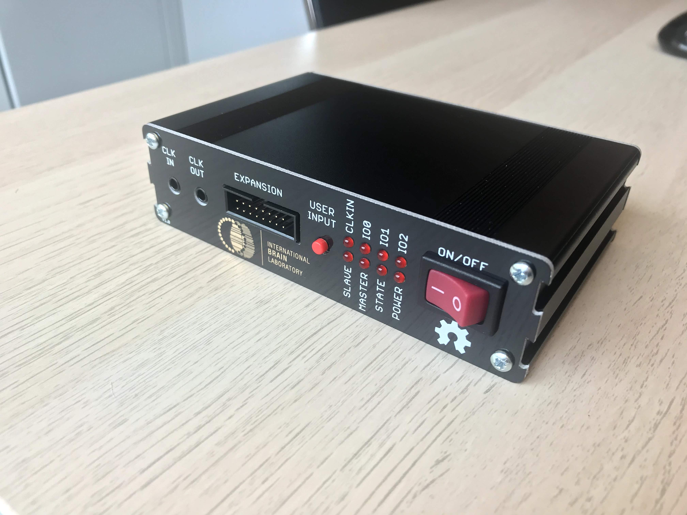

# IBL Behavior Control (IBL BC)

Repository for the IBL's new behavior control system, based on Harp technology.

# Licensing

The code, designs, documentation, and photos available in this repository is free: you can redistribute it and/or modify it under the terms of the used license.
Each subdirectory will contain a license or, possibly, a set of licenses if it involves both hardware and software. Check files named LICENSE.